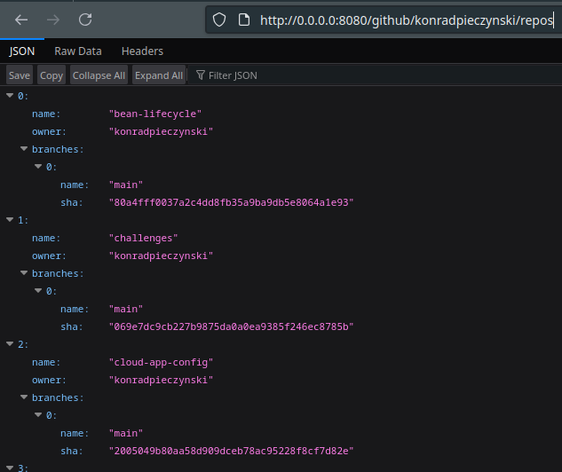
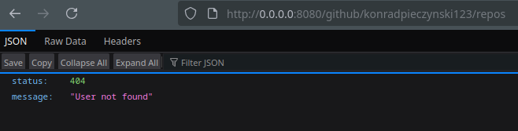

# GitHub Repository Explorer

## Overview
GitHub Repository Explorer is a Quarkus-based microservice that retrieves and processes GitHub repository information for a given user. The application focuses on fetching non-forked repositories and their associated branches using the GitHub API.

## Features
- Retrieve repositories for a specific GitHub user
- Filter out forked repositories
- Fetch branches for each repository
- Reactive programming with Mutiny
- RESTful API endpoint
- Error handling

## Technologies
- Java 17+
- Quarkus
- SmallRye Mutiny
- MicroProfile REST Client
- WireMock (for testing)
- JUnit 5
- Gradle

## Prerequisites
- JDK 17 or later
- Gradle 7.x+

## API Endpoints
### Get User Repositories
- **Endpoint:** `/github/{username}/repos`
- **Method:** GET
- **Description:** Retrieves non-forked repositories with their branches

### Example Request
```bash
curl http://localhost:8080/github/octocat/repos
```

## Error Handling
- 404 Not Found: User does not exist

## Screenshots

### Repository List


### Error Response


## Running the Application
### Development Mode
```bash
./gradlew quarkusDev
```

### Building for Production
```bash
./gradlew build
```

### Running Tests
```bash
./gradlew test
```

## Gradle Dependencies
`build.gradle` file contains the following dependencies:
```groovy
plugins {
  id 'java'
  id 'io.quarkus'
}

repositories {
  mavenCentral()
  mavenLocal()
}

dependencies {
  implementation enforcedPlatform("${quarkusPlatformGroupId}:${quarkusPlatformArtifactId}:${quarkusPlatformVersion}")
  implementation 'io.quarkus:quarkus-rest'
  implementation 'io.quarkus:quarkus-rest-client'
  implementation 'io.quarkus:quarkus-arc'
  implementation 'io.quarkus:quarkus-rest-client-jackson'
  implementation 'io.quarkus:quarkus-rest-jackson'
  testImplementation 'io.quarkus:quarkus-junit5'
  testImplementation 'io.quarkus:quarkus-junit5-mockito'
  testImplementation 'io.rest-assured:rest-assured'
  testImplementation 'org.mockito:mockito-core:5.16.0'
  compileOnly 'org.projectlombok:lombok:1.18.36'
  annotationProcessor 'org.projectlombok:lombok:1.18.36'

}

group 'org.github'
version '1.0-SNAPSHOT'

java {
  sourceCompatibility = JavaVersion.VERSION_21
  targetCompatibility = JavaVersion.VERSION_21
}

test {
  systemProperty "java.util.logging.manager", "org.jboss.logmanager.LogManager"
  jvmArgs += [
          "-javaagent:${configurations.testRuntimeClasspath.find { it.name.contains('byte-buddy-agent') }}"
  ]
}
compileJava {
  options.encoding = 'UTF-8'
  options.compilerArgs << '-parameters'
}

compileTestJava {
  options.encoding = 'UTF-8'
}

```

## Contributing
1. Fork the repository
2. Create a feature branch
3. Commit your changes
4. Push to the branch
5. Create a Pull Request

## License
MIT License

## Contact
For issues or questions, please open a GitHub issue.